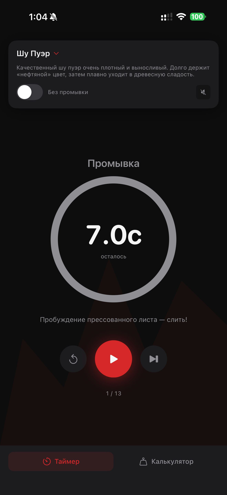
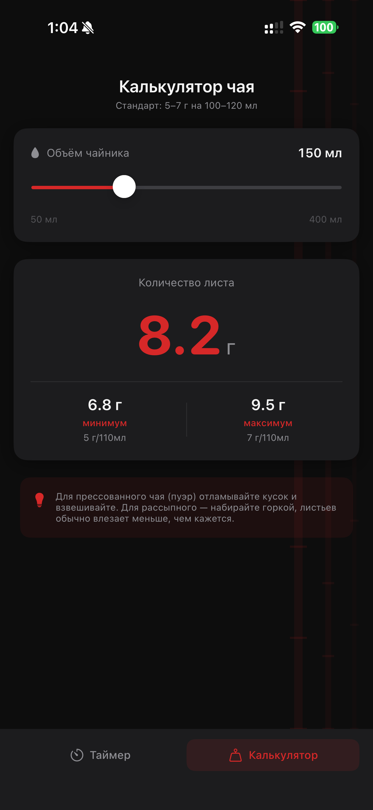

# PinChapp — Таймер Китайского Чаепития

Приложение для iOS и macOS, которое сопровождает домашнюю гунфу-церемонию китайского чая. Выбираешь сорт — приложение ведёт по проливам: показывает время выдержки, номер пролива и запускает круговой таймер.

<p align="center">
  
  &nbsp;&nbsp;&nbsp;
  
</p>

## Возможности

- **Таймер проливов** — круговой countdown с подсказкой по каждому проливу
- **6 сортов чая** — Шу Пуэр, Шэн Пуэр, Тёмный улун, Светлый улун, Красный чай, Белый чай
- **Промывка** — нулевой пролив включён по умолчанию, можно отключить
- **Калькулятор** — рассчитывает количество листа под объём чайника (5–7 г на 100–120 мл)
- **Звуковой сигнал** — опциональный ding по окончании пролива
- **macOS** — компактное окно, клавиатурные сокращения Space / →

## Стек

- SwiftUI + iOS 17+ / macOS 14+
- `TimelineView` для плавной анимации таймера без лагов
- `Task.sleep` вместо `Timer.publish` — нет дискретных тиков
- `AudioToolbox` для звука
- `UserDefaults` для сохранения настроек
- Без внешних зависимостей

## Структура

```
pinchapp-ios/
├── TeaData.swift          # Модели + все данные 6 сортов
├── SessionViewModel.swift # Логика таймера
├── SessionView.swift      # UI таймера + CircularTimerView
├── CalculatorView.swift   # Калькулятор граммов
├── ContentView.swift      # Корневой контейнер + таб-бар
└── PrivacyInfo.xcprivacy  # Privacy manifest
```

## Сборка

Открыть `pinchapp-ios.xcodeproj` в Xcode 16+, выбрать таргет и запустить.
